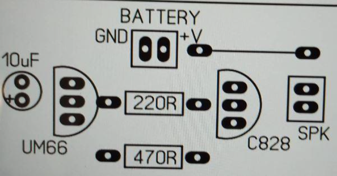
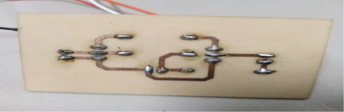
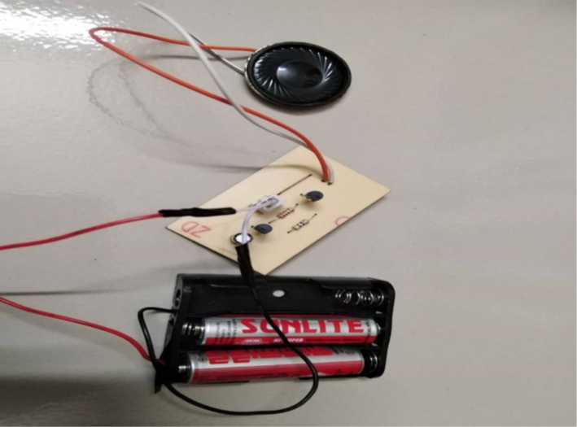

<h1 align="center">
Design of Calling Bell Circuit
</h1>

## Project Overview
This project involves designing and implementing a simple calling bell circuit using various electronic components. The project focuses on understanding basic circuit assembly, PCB design, and the use of components like transistors, capacitors, and buzzers. This calling bell circuit can be used in homes, offices, and other locations where a simple alerting system is required.

---

## Objectives
1. To learn how to make a calling bell circuit.
2. To understand and learn the procedure for PCB design.
3. To learn the use of different electronic components.

---

## Required Components
- **CCB Board (Copper Clad Board)**
- **Capacitor (10 µF, 1 piece)**
- **Resistors (220Ω, 470Ω; 1 piece each)**
- **C828 NPN Transistor (1 piece)**
- **Push Button Switch (1 piece)**
- **Buzzer (12V rated voltage, 3V operating voltage; 1 piece)**
- **IC UM66 (1 piece)**
- **Soldering Iron**
- **Sucker**
- **Lead Wire**
- **Connectors**
- **Battery (1.5V, 2 pieces)**

---

## Schematic Diagram
<h1 align="center">
   
</h1>

---

## Procedure for Making the Printed Circuit Board (PCB)
1. **PCB Design**  
   The circuit was designed in PCB design software and printed on photo paper with the lowest GSM for better accuracy.

2. **Transferring Design to Copper Clad Board (CCB)**  
   The CCB was cut according to the PCB design's size. The printed design was transferred onto the CCB by heating for about 20 minutes, leaving a marked design on the board. Unwanted parts were removed using water.

3. **Etching the CCB**  
   An etching solution made from ferric chloride and hexahydrate was used to remove unwanted copper, ensuring correct current flow paths.

4. **Drilling Component Points**  
   Specific points on the PCB were drilled to attach components, facilitating easy placement and soldering.

5. **Soldering Components**  
   Components were first placed on the PCB, followed by soldering using a soldering iron, lead wire, resin, and a sucker for precision.

<h1 align="center">
   
</h1>

---

## Testing and Result
Upon connecting the circuit to a power source, the buzzer successfully emitted sound, indicating the circuit's functionality.

<h1 align="center">
   
</h1>

---

## Result and Discussion
The calling bell circuit was successfully designed, assembled, and tested. When connected to a power source, the buzzer operated as intended, producing sound upon pressing the push button. This project provided valuable hands-on experience with PCB design, component handling, and circuit assembly.

